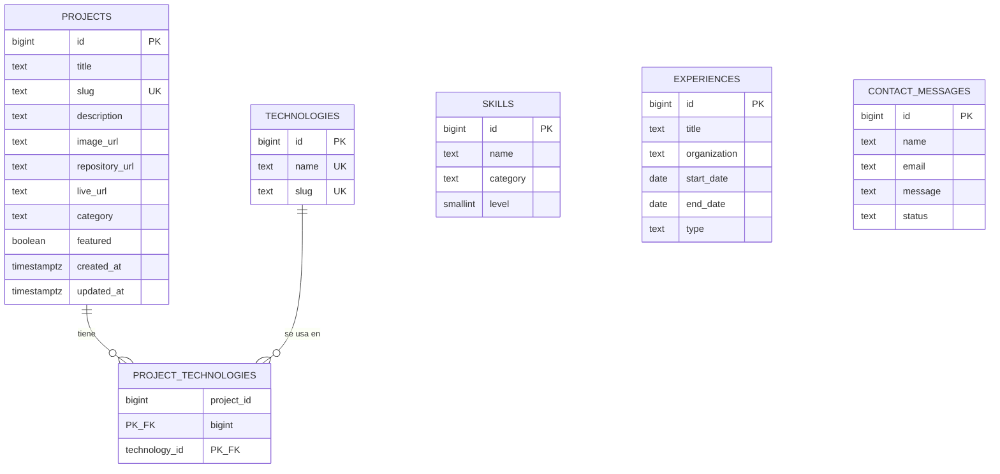

# Documentación técnica de la base de datos

Motor: **PostgreSQL**, provisto por **Supabase**. El script de creación
completo está en [`database/schema.sql`](../database/schema.sql) y los
datos de ejemplo en [`database/seed.sql`](../database/seed.sql).

## Diagrama entidad-relación



`skills`, `experiences` y `contact_messages` son tablas independientes:
no tienen claves foráneas hacia otras tablas porque no necesitan
relacionarse con nada más (una habilidad no "pertenece" a un proyecto,
por ejemplo). La única relación real del modelo es **proyectos ↔
tecnologías**, que sí es muchos a muchos.

## Relaciones y claves

| Tabla                   | Clave primaria              | Claves foráneas                                  |
|-------------------------|------------------------------|---------------------------------------------------|
| `technologies`          | `id`                         | —                                                   |
| `projects`               | `id`                         | —                                                   |
| `project_technologies`   | (`project_id`, `technology_id`) compuesta | `project_id` → `projects.id`, `technology_id` → `technologies.id` |
| `skills`                 | `id`                         | —                                                   |
| `experiences`            | `id`                         | —                                                   |
| `contact_messages`       | `id`                         | —                                                   |

`project_technologies` es una **tabla puente** (o de asociación): existe
únicamente para poder representar que un proyecto tiene varias
tecnologías y una tecnología aparece en varios proyectos. Las columnas
tienen `on delete cascade`: si se borra un proyecto, sus filas de
relación se borran solas (no queda relación "huérfana" apuntando a un
proyecto inexistente).

## Por qué las tecnologías están separadas de los proyectos

La alternativa fácil sería guardar las tecnologías como texto plano
dentro de `projects`, por ejemplo:

```
title: "Portfolio"    technologies: "React, Node.js, PostgreSQL"
```

Esto se evitó a propósito porque trae varios problemas:

- **Duplicación**: el nombre "React" se reescribe en cada proyecto que lo
  use, con el riesgo de escribirlo distinto cada vez (`React`, `react`,
  `ReactJS`).
- **Sin integridad**: nada impide un typo, y no hay forma de saber
  "¿cuántos proyectos usan React?" sin parsear texto.
- **Difícil de mantener**: renombrar una tecnología implicaría editar
  todas las filas de `projects` que la mencionen.

Separándolas en `technologies` + `project_technologies`, cada tecnología
existe **una sola vez**, se referencia por `id`, y agregar o quitar una
tecnología de un proyecto es simplemente insertar o borrar una fila en
la tabla puente.

## Normalización

### Primera Forma Normal (1FN) — valores atómicos

Cada columna guarda un único valor, no listas. El ejemplo más claro es
justamente el de arriba: en vez de una celda `technologies` con varios
valores separados por coma (lo que violaría 1FN), cada tecnología es su
propia fila en `technologies`, y la asociación vive en
`project_technologies` — una fila por cada combinación proyecto+tecnología.

### Segunda Forma Normal (2FN) — sin dependencias parciales

Aplica a tablas con clave primaria **compuesta**: acá la única es
`project_technologies`, con clave (`project_id`, `technology_id`). La
tabla no tiene ningún otro atributo (no guarda, por ejemplo, la fecha en
que se agregó la tecnología al proyecto) — como no hay atributos no-clave,
no hay nada que pueda depender de solo una parte de la clave. 2FN se
cumple por diseño: la tabla puente se mantiene mínima a propósito.

### Tercera Forma Normal (3FN) — sin dependencias transitivas

Ningún atributo no-clave depende de otro atributo no-clave. Ejemplo
concreto de lo que se evitó: si `projects` tuviera una columna
`technology_name` además de la relación con `project_technologies`, ese
nombre dependería de `technology_id` (un atributo no-clave) y no
directamente de `projects.id` — eso sería una dependencia transitiva. Al
guardar el nombre **solo** en `technologies.name`, y acceder a él siempre
a través del `id`, se evita: cada dato vive en un único lugar.

## Seguridad

- **Variables de entorno**: las credenciales de Supabase (`SUPABASE_URL`,
  `SUPABASE_SERVICE_ROLE_KEY`) viven en `Back/.env`, que está en
  `.gitignore` y nunca se sube al repositorio. `Back/.env.example`
  documenta qué variables hacen falta, sin valores reales.
- **anon key vs. service role key**: Supabase entrega dos claves. La
  **anon key** está pensada para usarse en el navegador (su seguridad
  depende de las políticas de RLS, no de mantenerla en secreto). La
  **service role key** ignora RLS por completo y es secreta: en este
  proyecto **solo el backend la usa**, y el frontend ni siquiera la
  conoce — el frontend solo sabe la URL del backend (`VITE_API_URL`).
- **Row Level Security (RLS)**: activado en las seis tablas. Hay
  políticas de lectura pública (`select`) en `technologies`, `projects`,
  `project_technologies`, `skills` y `experiences`, porque son los datos
  que muestra la landing. **Ninguna tabla tiene políticas de
  insert/update/delete** para los roles públicos (`anon`/`authenticated`):
  sin una política que lo permita, RLS deniega la escritura por defecto.
  Solo el backend, con la service role key (que ignora RLS), puede
  escribir.
- **`contact_messages` sin política de lectura**: a diferencia de las
  otras tablas, los mensajes de contacto no tienen ninguna política
  pública, ni de lectura ni de escritura. Contienen datos personales
  (nombre, email) de quien escribe, así que solo el backend puede
  leerlos o insertarlos.
- **Autenticación del panel admin**: usa Supabase Auth
  (`signInWithPassword`). No hay registro público de usuarios — se
  deshabilita desde el dashboard de Supabase — y el único usuario
  administrador se crea a mano (ver
  [`database/README.md`](../database/README.md)). El backend valida el
  token de sesión (`supabase.auth.getUser`) en cada petición de
  escritura antes de tocar la base (`Back/src/middleware/requireAuth.js`).
- **Validación server-side**: el backend valida el formato de cada
  payload (`Back/src/validators/*.js`) de forma independiente a la
  validación del frontend, porque nunca hay que confiar en datos que
  llegan del cliente.
